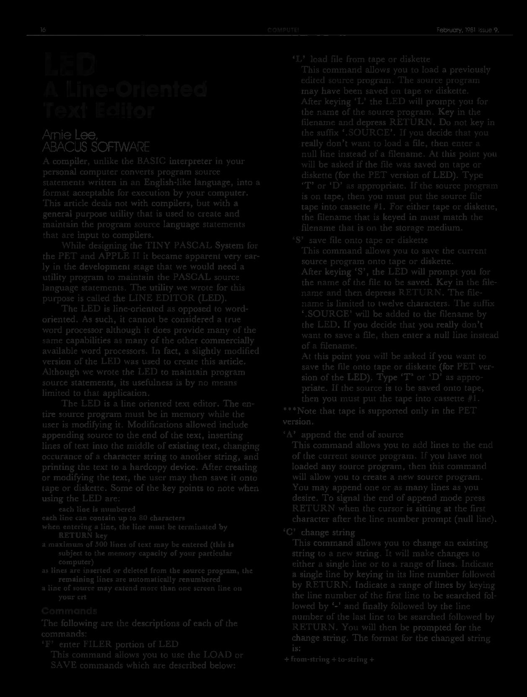
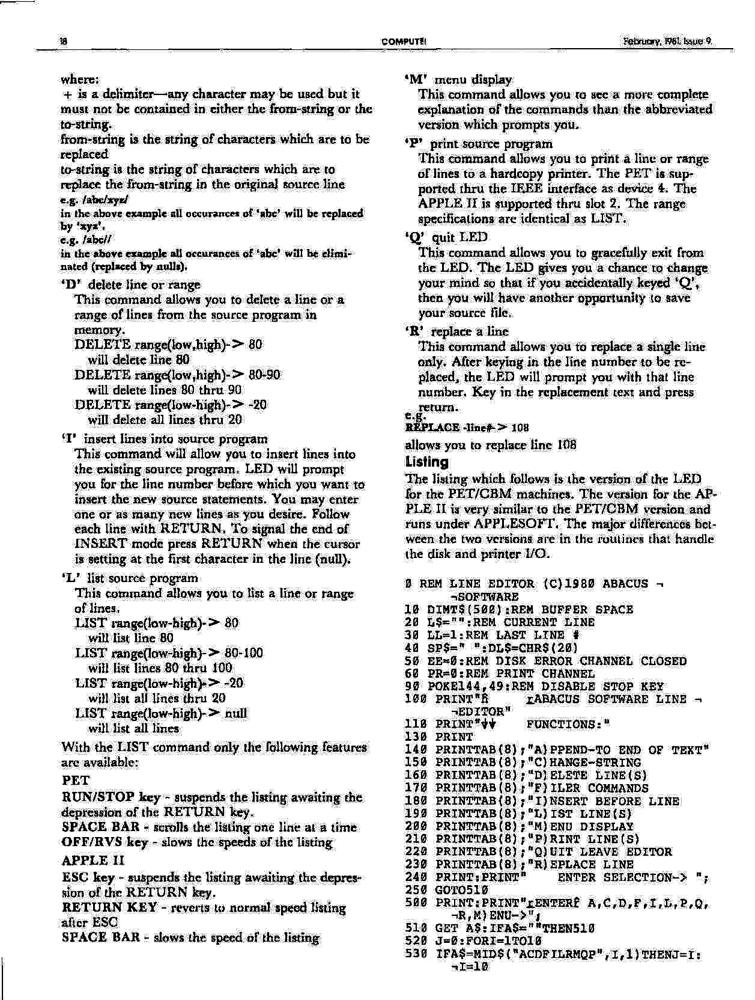
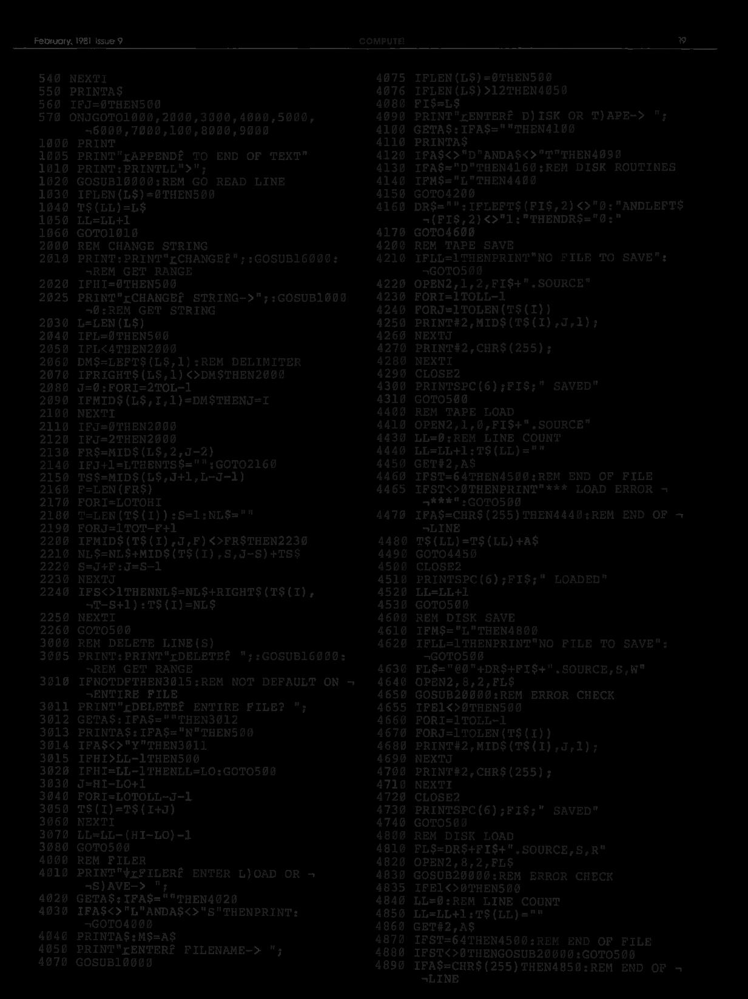
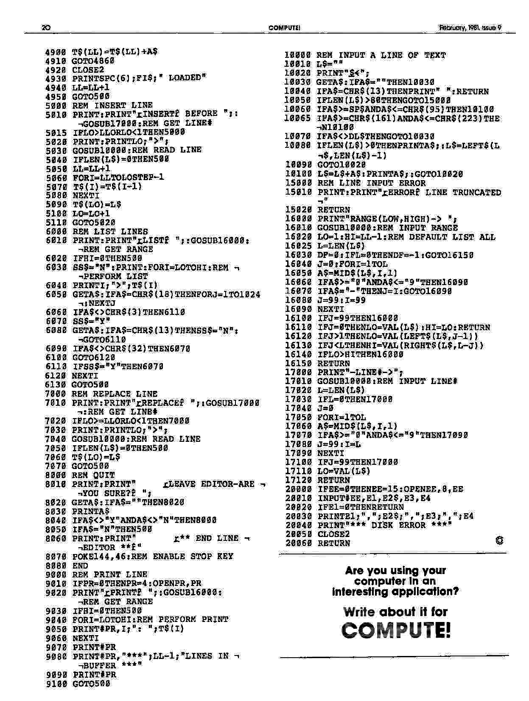

---
title: L.E.D.
subtitle: Line-Oriented Text Editor
author: Arnie Lee
date: Feb, 1981.
...

The LED is line-oriented as opposed to word-oriented.  As such, it
cannot be considered a true word processor although it does provide
many of the same capabilities as many of the other commercially
available word processors.  In fact, a slightly modified version of
the LED was used to create this article.  Although we wrote the LED to
maintain program source statements, its usefulness is by no means
limited to that application.

The LED is a line oriented text editor.  The entire source program
must be in memory while the user is modifying it.  Modifications
allowed include appending source to the end of the text, inserting
lines of text into the middle of existing text, changing occurance of
a character string to another string, and printing the text to a
hardcopy device.  After creating or modifying the text, the user may
then save it onto tape or diskette.  Some of the key points to note
when using the LED are:

- Each line is numbered;
- Each line can contain up to 80 characters;
- When entering 3 line, the line must be terminated by `RETURN` key;
- A maximum of 500 lines of text may be entered (this is subject to
  the memory capacity of your particular computer);
- As lines arc inserted or deleted from the source program, the
  remaining lines arc automatically renumbered;
- A line of source may extend more than one screen line on your CRT.

\newpage

# Commands.

The following arc the descriptions of each of the commands:

## 'F' 

### Enter FILER portion of LED.

This command allows you to use the LOAD or SAVE commands which arc
described below:


## 'L' 

### Load file from tape or diskette.

This command allows you to load a previously edited source program.
The source program may have been saved on tape or diskette.  After
keying 'L' the LED will prompt you for the name of the source program.
Key in the filename and depress `RETURN`.  Do not key in the suffix
`.SOURCE`.  If you decide that you really don't want to load a file,
then enter a null line instead of a filename.  At this point you will
be asked if the file was saved on tape or diskette (for the PET
version of LED).  Type 'T' or 'D' as appropriate.  If the source
program is on tape, then you must put the source file tape into
cassette #1.  For either tape or diskette, the filename that is keyed
in must match the filename that is on the storage medium.

## 'S'

### Save  file  onto  tape  or  diskette.

This command allows you to save the current source program onto tape
or diskette.  After keying 'S', the LED will prompt you for the name
of the file to be saved.  Key in the file-name and then depress
`RETURN`.  The file-name is limited to twelve characters.  The suffix
`.SOURCE` will be added to the filename by the LED.  If you decide
that you really don't want to save a file, then enter a null line
instead of a filename.

At this point you will be asked if you want to save the file onto tape
or diskette (for PET version of the LED).  Type 'T' or 'D' as
appropriate. If the source is to be saved onto tape, then you must put
the tape into cassette #1.

*** Note that tape is supported only in the PET version.

## 'A'

### Append  the  end  of  source. 

This command allows you to add lines to the end of the current source
program.  If you have not loaded any source program, then this command
will allow you to create a new source program.  You may append one or
as many lines as you desire.  To signal the end of append mode press
`RETURN` when the cursor is sitting at the first character after the
line number prompt (null line).

## 'C'

### Change  string. 

This command allows you to change an existing string to a new string.
It will make changes to either a single line or to a range of lines.
Indicate a single line by keying in its line number followed by
`RETURN`.  Indicate a range of lines by keying the line number of the
first line to be searched followed by '-' and finally followed by
the line number of the last line to be searched followed by `RETURN`.
You will then be prompted for the change siring.  The format for the
changed string is:

`
+ from-string + to-string + 
`

where:


`+` is a delimiter — any character may be used but it must not be
contained in cither the `from-string` or the `to-string`.

`from-string` is the string of characters which are to be replaced

`to-string` is the string of characters which are to replace the
from-string in the original source line

```
e.g.  /abc/xyz/ 
```

in the above example all occurances of `abc` will be replaced by
`xyz`.

```
e.g.  /abc// 
```

in the above example all occurances of 'abc' will be eliminated
(replaced by nulls).

## 'D' 

### Delete  line  or  range. 

This command allows you to delete a line or a range of lines from the
source program in memory.

`
DELETE  RANGE(LOW,HIGH)->  80 
`
will  delete  line  80 

`
DELETE  RANGE(LOW,HIGH)->  80-90 
`

will  delete  lines  80  thru  90 

`
DELETE  RANGE(LOW-HIGH)->  -20 
`

will  delete  all  lines  thru  20 

'I' insert lines into source program

This command will allow you to insert lines into the c-xisiing source
program.  LED will prompt you for the line number before which you
want to insert the new source statements.  You may enter one or as
many new lines as you desire.  Follow each line with `RETURN`.  To
signal the end of INSERT mode press `RETURN` when the cursor is
setting at the first character in the line (null).

'L' list source program

This command allows you to list a line or range of lines.

`
LIST  RANGE(LOW-HIGH)->  80 
`

will list line 80

`
LIST  RANGE(LOW-HIGH)->  80-100 
`

will list lines 80 thru 100

`
LIST  RANGE(LOW-HIGH)->  -20 
`

will list all lines thru 20

`
LIST  RANGE(LOW-HIGH)->  NULL 
`

will list all lines

With the LIST command only the following features are available:

### PET.

`RUN/STOP` key - suspends the listing awaiting the depression of the
`RETURN` key.

`SPACE BAR` - scrolls the listing one line at a time

`OFF/RVS` key - slows the speeds of the listing

### APPLE  II.

`ESC` key - suspends the listing awaiting the depres- sion of the `RETURN`
key.

`RETURN` key - reverts to normal speed listing after ESC

`SPACE BAR` - slows the speed of the listing


## 'M' 

### Menu display.

This command allows you to sec a more complete explanation of the
commands than the abbreviated version which prompts you,

## 'P' 

### Print source program.

This command allows you to print a line or range of lines to a
hardcopy printer.  The PET is supported thru the IEEE interface as
device 4.  The APPLE II is supported thru slot 2.  The range
specifications are identical as LIST.

## 'Q'

### Quit LED.

This command allows you to gracefully exit from the LED.  The LED
gives you a chance to change your mind so that if you accidentally
keyed `Q`, then you will have another opporttmity to save your source
file.

## 'R' 

### Replace a line.

This command allows you to replace a single line only.  After keying
in the line number to be replaced, the LED will prompt you with that
line number.  Key in the replacement text and press return.

e.g. 

`
REPLACE -LINE#->  108 
`

allows you to replace line 108.

\newpage

# Listing.

The listing which follows is the version of the LED lor the PET/CBM
machines.  The version for the APPLE II is very similar to the PET/CBM
version and runs under APPLESOFT.  The major differences between the
two versions are in the routines that handle the disk and printer I/O.

```
0 REM LINE EDITOR (c)1980 ABACUS SOFTWARE
10 DIM T$(500):REM BUFFER SPACE
20 L$="":REM CURRENT LINE
30 LL=1:REM LAST LINE #
40 SP$=" ":DL$=CHR$(20)
50 EE=0:REM DISK ERROR CHANNEL CLOSED
60 PR=0: REM PRINT CHANNEL
90 POKE 144,49:REM DISABLE STOP KEY
100 PRINT "       ABACUS SOFTWARE LINE EDITOR"
110 PRINT "      FUNCTIONS:"
130 PRINT
140 PRINT TAB(8);"A)PPEND-TO END OF TEXT"
150 PRINT TAB(8);"C)HANGE-STRING"
160 PRINT TAB(8);"D)ELETE LINE(S)"
170 PRINT TAB(8);"F)ILER COMMANDS"
180 PRINT TAB(8);"I)NSERT BEFORE LINE"
190 PRINT TAB(8);"L)IST LINE(S)"
200 PRINT TAB(8);"M)ENU DISPLAY"
210 PRINT TAB(8);"P)RINT LINE(S)"
220 PRINT TAB(8);"Q)UIT LEAVE EDITOR"
230 PRINT TAB(8);"R)EPLACE LINE"
240 PRINT:PRINT "    ENTER SELECTION-> ";
250 GOTO 510
500 PRINT:PRINT "ENTER A,C,D,F,I,L,P,Q,R,M)ENU->";
510 GET A$:IF A$="" THEN 510
520 J=0:FOR I=1 TO 10
530 IF A$=MID$("ACDFILRMQP",I,1) THEN J=I:I=10
540 NEXT I
550 PRINT A$
560 IF J=0 THEN 500
570 ON J GOTO 1000,2000,3000,4000,5000,6000,7000,100,8000,9000
1000 PRINT
1005 PRINT "APPEND TO END OF TEXT"
1010 PRINT:PRINT LL ">";
1020 GOSUB 10000:REM GO READ LINE
1030 IF LEN(L$)=0 THEN 500
1040 T$(LL)=L$
1050 LL=LL+1
1060 GOTO 1010
2000 REM CHANGE STRING
2010 PRINT:PRINT "CHANGE";:GOSUB 16000:REM GET RANGE
2020 IF HI=0 THEN 500
2025 PRINT "CHANGE STRING->";:GOSUB 10000:REM GET STRING
2030 L=LEN(L$)
2040 IF L=0 THEN 500
2050 IF L<4 THEN 2000
2060 DM$=LEFT$(L$,1):REM DELIMITER
2070 IF RIGHT$(L$,1)<>DM$ THEN 2000
2080 J=0: FOR I=2 TO L-1
2090     IF MID$(L$,I,1)=DM$ THEN J=I
2100 NEXT I
2110 IF J=0 THEN 2000
2120 IF J=2 THEN 2000
2130 FR$=MID$(L$,2,J-2)
2140 IF J+1=L THEN TS$="":GOTO 2160
2150 TS$=MID$(L$,J+1,L-J-1)
2160 F=LEN(FR$)
2170 FOR I=LO TO HI
2180     T=LEN(T$(I)):S=1:NL$=""
2190     FOR J=1 TO T-F+1
2200         IF MID$(T$(I),J,F)<>FR$ THEN 2230
2210         NL$=NL$+MID$(T$(I),S,J-S)+TS$
2220         S=J+F:J=S-1
2230     NEXT J
2240     IF S<>1 THEN NL$=NL$+RIGHT$(T$(I),T=S+1):T$(I)=NL$
2250 NEXT I
2260 GOTO 500
3000 REM DELETE LINES(S)
3005 PRINT:PRINT "DELETE ";:GOSUB 16000:REM GET RANGE
3010 IF NOT DF THEN 3015:REM NOT DEFAULT ON ENTIRE FILE
3011 PRINT "DELETE ENTIRE FILE? ";
3012 GET A$:IF A$="" THEN 3012
3013 PRINT A$:IF A$="N" THEN 500
3014 IF A$<>"Y" THEN 3011
3015 IF HI>LL-1 THEN 500
3020 IF HI=LL-1 THEN LL=LO:GOTO 500
3030 J=HI-LO+1
3040 FOR I=LO TO LL-J-1
3050     T$(I)=T$(I+J)
3060 NEXT I
3070 LL=LL-(HI-LO)-1
3080 GOTO 500
4000 REM FILER
4010 PRINT "FILER ENTER L)OAD OR S)AVE-> ";
4020 GET A$:IF A$="" THEN 4020
4030 IF A$<>"L" AND A$<>"S" THEN PRINT:GOTO 4000
4040 PRINT A$:M$=A$
4050 PRINT "ENTER FILENAME-> ";
4070 GOSUB 10000
4075 IF LEN(L$)=0 THEN 500
4076 IF LEN(L$)>12 THEN 4050
4080 FI$=L$
4090 PRINT "ENTER D)ISK OR T)APE-> ";
4100 GET A$:IF A$="" THEN 4100
4110 PRINT A$
4120 IF A$<>"D" AND A$<>"T" THEN 4090
4130 IF A$="D" THEN 4160:REM DISK ROUTINES
4140 IF M$="L" THEN 4400
4150 GOTO 4200
4160 DR$="":IF LEFT$(FI$,2)<>"0:" AND LEFT$(FI$,2)<>"1:" THEN DR$="0:"
4170 GOTO 4600
4200 REM TAPE SAVE
4210 IF LL=1 THEN PRINT "NO FILE TO SAVE":GOTO 500
4220 OPEN 2,1,2,FI$+".SOURCE"
4230 FOR I=1 TO LL-1
4230     FOR J=1 TO LEN(T$(I))
4250         PRINT# 2,MID$(T$(I),J,1);
4260	 NEXT J
4270     PRINT# 2,CHR$(255);
4280 NEXT I
4290 CLOSE 2
4300 PRINT SPC(6);FI$;" SAVED"
4310 GOTO 500
4400 REM TAPE LOAD
4410 OPEN 2,1,0,FI$+".SOURCE"
4430 IF=L0:REM LINE COUNT
4440 LL=LL+1:T$(LL)=""
4450 GET# 2,A$
4460 IF ST=64 THEN 4500:REM END OF FILE
4465 IF ST<>0 THEN PRINT "*** LOAD ERROR ***":GOTO 500
4470 IF A$=CHR$(255) THEN 4440:REM END OF LINE
4480 T$(LL)=T$(LL)+A$
4490 GOTO 4450
4500 CLOSE 2
4510 PRINT SPC(6);FI$;" LOADED"
4520 LL+LL+1
4530 GOTO 500
4600 REM DISK SAVE
4610 IF M$="L" THEN 4800
4620 IF LL=1 THEN PRINT "NO FILE TO SAVE":GOTO 500
4630 FL$="@0"+DR$+FI$+".SOURCE,S,W"
4640 OPEN 2,8,2,FL$
4650 GOSUB 20000:REM ERROR CHECK
4655 IF E1<>0 THEN 500
4660 FOR I=1 TO LL-1
4670     FOR J=1 TO LEN(T$(I))
4680         PRINT# 2,MID$(T$(I),J,1);
4690     NEXT J
4700     PRINT# 2,CHR$(255);
4710 NEXT I
4720 CLOSE 2
4730 PRINT SPC(6);FI$;" SAVED"
4740 GOTO 500
4800 REM DISK LOAD
4810 FL$=DR$+FI$+".SOURCE,S,R"
4820 OPEN 2,8,2,FL$
4830 GOSUB 20000:REM ERROR CHECK
4835 IF E1<>0 THEN 500
4840 LL=0:REM LINE COUNT
4850 LL=LL+1:T$(LL)=""
4860 GET# 2,A$
4870 IF ST=64 THEN 4500: REM END OF FILE
4880 IF ST<>0 THEN GOSUB 20000:GOTO 500
4890 IF A$=CHR$(255) THEN 4850:REM END OF LINE
4900 T$(LL)=T$(LL)+A$
4910 GOTO 4860
4920 CLOSE 2
4930 PRINT SPC(6);FI$;" LOADED"
4940 LL=LL+1
4950 GOTO 500
5000 REM INSERT LINE
5010 PRINT:PRINT "INSERT BEFORE ";:GOSUB 17000:REM GET LINE #
5015 IF LO>LL OR LO<1 THEN 5000
5020 PRINT:PRINT LO;">";
5030 GOSUB 10000:REM READ LINE
5040 IF LEN(L$)=0 THEN 500
5050 LL=LL+1
5060 FOR I=LL TO LO STEP -1
5070     T$(LO)=L$
5080 NEXT I
5090 T$(LO)=L$
5100 LO=LO+1
5110 GOTO 5020
6000 REM LIST LINES
6010 PRINT:PRINT "LIST ";:GOSUB 16000:REM GET RANGE
6020 IF HI=0 THEN 500
6030 SS$="N":PRINT:FOR I=LO TO HI:REM PERFORM LIST
6040 PRINT I;">";T$(I)
6050 GET A$:OF A$=CHR$(18) THEN FOR J=1 TO 1024:NEXT J
6060 IF A$<>CHR$(3) THEN 6110
6070 SS$="Y"
6080 GET A$:IF A$=CHR$(13) THEN SS$="N":GOTO 6110
6090 IF A$<>CHR$(32) THEN 6070
6100 GOTO 6120
6110 IF SS$="Y" THEN 6070
6120 NEXT I
6130 GOTO 500
7000 REM REPLACE LINE
7010 PRINT:PRINT "REPLACE ";:GOSUB 17000:REM GET LINE #
7020 IF LO>=LL OR LO<1 THEN 7000
7030 PRINT:PRINT LO;">";
7040 GOSUB 10000:REM READ LINE
7050 IF LEN(L$)=0 THEN 500
7060 T$(LO)=L$
7070 GOTO 500
8000 REM QUIT
8010 PRINT:PRINT "     LEAVE EDITOR-ARE YOU SURE? ";
8020 GET A$:IF A$="" THEN 8020
8030 PRINT A$
8040 IF A$<>"Y" AND A$<>"N" THEN 8000
8050 IF A$="N" THEN 500
8060 PRINT:PRINT "           ** END LINE EDITOR **"
8070 POKE 144,46:REM ENABLE STOP KEY
8080 END
9000 REM PRINT LINE
9010 IF PR=0 THEN PR=4 OPEN PR,PR
9020 PRINT "PRINT ";:GOSUB 16000:REM GET RANGE
9030 IF HI=0 THEN 500
9040 FOR I=LO TO HI:REM PERFORM PRINT
9050     PRINT# PR,I;": ";T$(I)
9060 NEXT I
9070 PRINT# PR
9080 PRINT# PR,"***";LL-1;"LINES IN BUFFER ***"
9090 PRINT #PR
9100 GOTO 500
10000 REM INPUT A LINE OF TEXT
10010 L$=""
10020 PRINT "$<-";
10030 GET A$:IF A$="" THEN 10030
10040 IF A$=CHR$(13) THEN PRINT " ":RETURN
10050 IF LEN(L$)>80 THEN GOTO 15000
10060 IF A$>=SP$ AND A$<=CHR$(95) THEN 10100
10065 IF A$>=CHR$(161) AND A$<=CHR$(223) THEN 10100
10070 IF A$<>DL$ THEN GOTO 10030
10080 IF LEN(L$)>0 THEN PRINT A$;:L$=LEFT$(L$,LEN(L$)-1)
10090 GOTO 10020
10100 L$=L$+A$:PRINT A$;:GOTO 10020
15000 REM LINE INPUT ERROR
15010 PRINT:PRINT "ERROR LINE TRUNCATED"
15020 RETURN
16000 PRINT "RANGE(LOW,HIGH)-> ";
16010 GOSUB 10000:REM INPUT RANGE
16020 LO=1:HI=LL-1:REM DEFAULT LIST ALL
16025 L=LEN(L$)
16030 DF=0:IF L=0 THEN DF=-1:GOTO 16150
16040 J=0:FOR I=1 TO L
16050 A$=MID$(L$,I,1)
16060 IF A$>="0" AND A$<="9" THEN 16090
16070 IF A$="-" THEN J=I:GOTO 16090
16080 J=99:I=99
16090 NEXT I
16100 IF J=99 THEN 16000
16110 IF J=0 THEN LO=VAL(L$):HI=LO:RETURN
16120 IF J>1 THEN LO=VAL(LEFT$(L$,J-1))
16130 IF J<L THEN HI=VAL(RIGHT$(L$,L-J))
16140 IF LO>HI THEN 16000
16150 RETURN
17000 PRINT "-LINE#->";
17010 GOSUB 10000:REM INPUT LINE#
17020 L=LEN(L$)
17030 IF L=0 THEN 17000
17040 J=0
17050 FOR I=1 TO L
17060     A$=MID$(L$,I,1)
17070     IF A$>="0" AND A$<="9" THEN 17090
17080     J=99:I=L
17090 NEXT I
17100 IF J=99 THEN 17000
17110 LO=VAL(L$)
17120 RETURN
20000 IF EE=0 THEN EE=15:OPEN EE,8,EE
20010 INPUT# EE,E1,E2$,E3,E4
20020 IF E1=0 THEN RETURN
20030 PRINT E1;",";E2$;",";E3:",";E4
20040 PRINT "*** DISK ERROR ***"
20050 CLOSE 2
20060 RETURN
```

\newpage

# MAGAZINE SCANS








