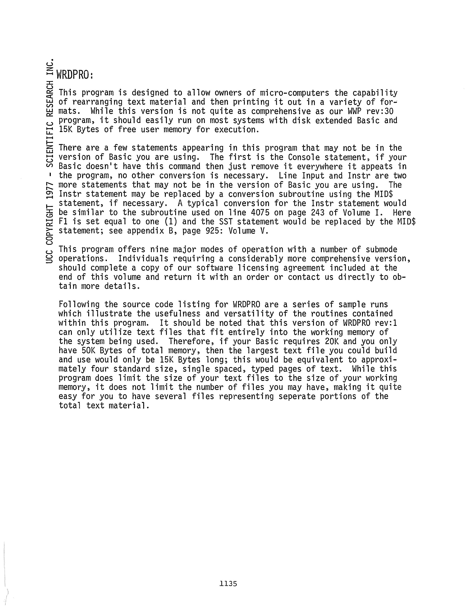
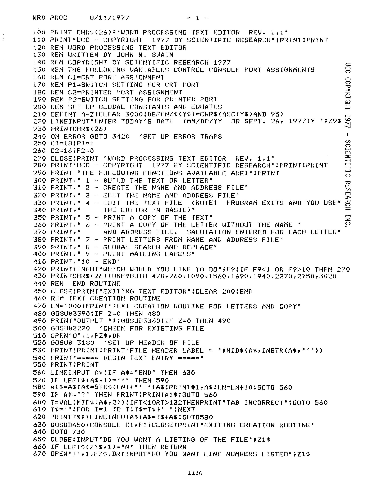
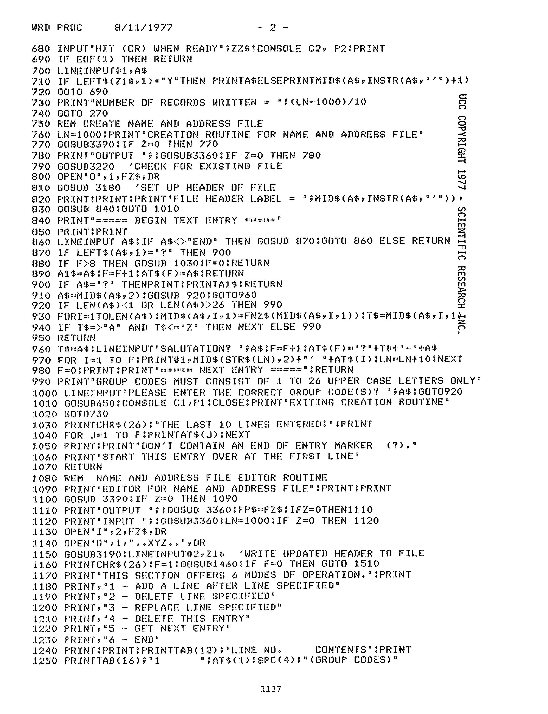
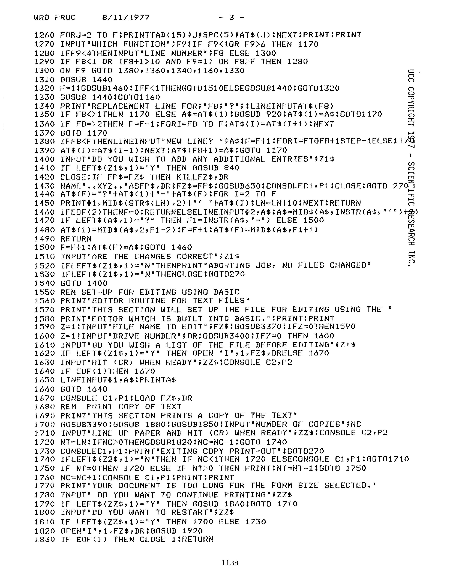
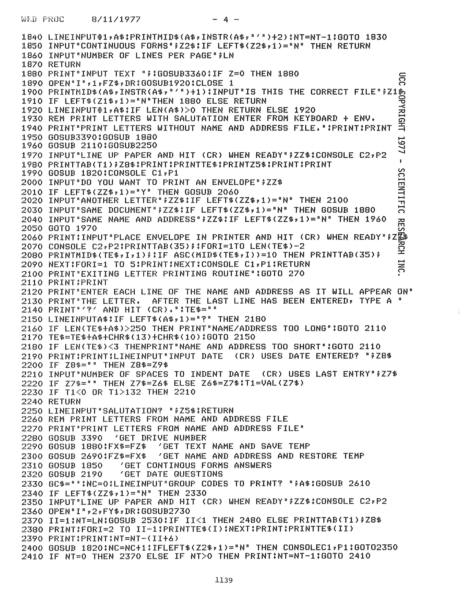
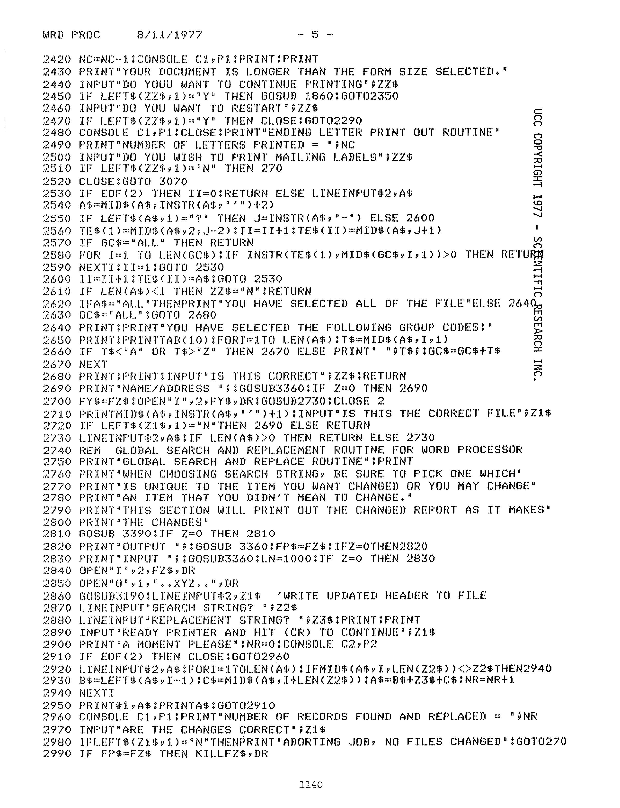
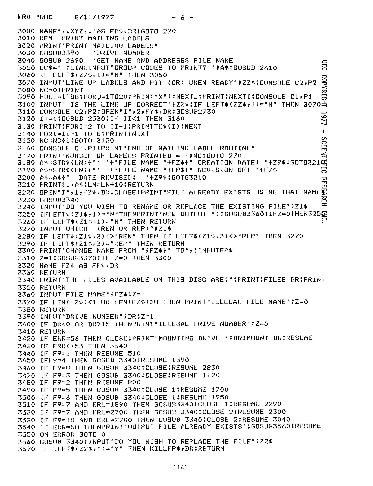
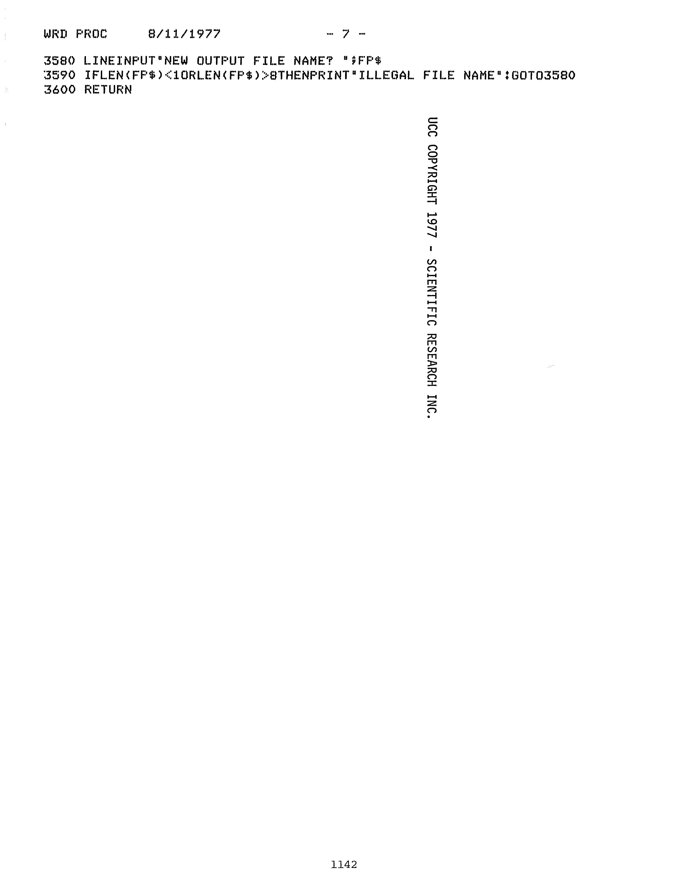

# WRDPRO:

## Word Processing Text Editor Rev. 1.1

##  John W. Swain

## SCIENTIFIC RESEARCH INC.

## Brown, R.W. (1977) Basic software library. 7, professional programs Vol 7. Key Biscayne, Fla: Scientific Research Inst. 

This program is designed to allow owners of micro-computers the
capability of rearranging text material and then printing it out in a
variety of formats. While this version is not quite as comprehensive
as our WWP rev:30 program, it should easily run on most systems with
disk extended Basic and 15K Bytes of free user memory for execution.

There are a few statements appearing in this program that may not be
in the version of Basic you are using. The first is the Console
statement, if your (/) Basic doesn't have this command then just
remove it everywhere it appeats in 1 the program, no other conversion
is necessary.  Line Input and Instr are two more statements that may
not be in the version of Basic you are using. The Instr statement may
be replaced by a conversion subroutine using the MID$ statement, if
necessary.  A typical conversion for the Instr statement would a be
similar to the subroutine used on line 4075 on page 243 of Volume
I. Here F1 is set equal to one (1) and the SST statement would
be replaced by the MID$ statement; see appendix B, page 925:
Volume V.

This program offers nine major modes of operation with a number of
submode operations.  Individuals requiring a considerably more
comprehensive version, should complete a copy of our software
licensing agreement included at the end of this volume and return it
with an order or contact us directly to obtain more details.

Following the source code listing for WRDPRO are a series of sample
runs which illustrate the usefulness and versatility of the routines
contained within this program. It should be noted that this version of
WRDPRO rev:1 can only utilize text files that fit entirely into the
working memory of the system being used. Therefore, if your Basic
requires 20K and you only have 50K Bytes of total memory, then the
largest text file you could build and use would only be 15K Bytes
long; this would be equivalent to approximately four standard size,
single spaced, typed pages of text. While this program does limit the
size of your text files to the size of your working memory, it does
not limit the number of files you may have, making it quite easy for
you to have several files representing seperate portions of the total
text material.

# MAGAZINE SCANS

