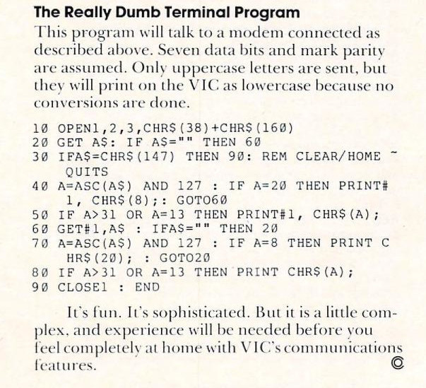
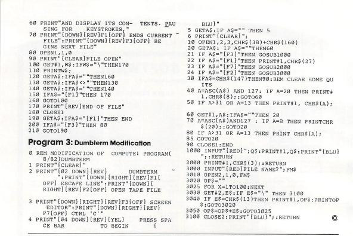

# Project phase three - ACTIVE

> The hardware platform of the permacomputer is largely settled.
> 
> Please see [phase-2.md](phase-2.md).

The permacomputer itself now needs some sort of user operating
environment--a human-computer interface.

The project is opting for the distribution of the software environment
in paradigmatic microcomputer BASIC.

The various utilities and tools will be printed as code listings.

The archival quality of paper is many orders of magnitude better than
hard disks, CD-ROMs, or other digital mediums.

https://github.com/slviajero/tinybasic

Please find below the transcriptions of the type-in listings of the
absolute minimum variety of tools and utilities a user will require to
operate their permacomputer.

It will take some time to render them into BASIC that the above github
repo tinybasic will accept.

---

## Table of contents.

### A gopher browser.

_Research not started_.

### Text editors.

- `100 REM PET/APPLE II` [`LED.BAS`](#led) - _Transcription complete_.
- `200 REM TELEPRINTER` [`WRDPRO.BAS`](#wrdpro) - _Transcription complete_.
- `300 REM VIC` [`EDITYPE.BAS`](#vic-editype) - _Transcription complete_.
- `400 REM ATARI` [`SCRIPTOR.BAS`](#scriptor) - _Transcription **started**_.
- `500 REM ALTAIR 8K` [`EDIT.BAS`]() - _Transcription complete_.

### Terminal programs.

- `REM 500 VIC` [`DUMBTERM.BAS`](#dumbterm)
- `REM 600 VIC` [`VICSTATION - DUMBTERM.BAS`](#dumbterm-modification)

### Filers.

- `700 REM TELEPRINTER` [`UTILITY.BAS`](#utility)

---

## GOPHER BROWSER.

_Research not started_.

## TEXT EDITORS

| Filename                    | Year | Platform             | Transcription status | Lines of code | Code size |
|-----------------------------|------|----------------------|----------------------|---------------|-----------|
| [LED.BAS](#led)             | 1981 | CBM PET, APPLE II    | COMPLETE             | < 300         | ~ 7 KB    |
| [WRDPRO.BAS](#wrdpro)       | 1977 | GE 635 _(Dartmouth)_ | COMPLETE             | ~ 350         | ~ 17 KB   |
| [EDITYPE.BAS](#vic-editype) | 1983 | VIC-20               | COMPLETE             | ~ 150         | ~ 5 KB    |
| [SCRIPTOR.BAS](#scriptor)   | 1983 | ATARI 8-BIT          | STARTED              | NOT FINISHED  |           |
| [EDIT.BAS](#edit)           | 1977 | ALTAIR 8K            | COMPLETE             | ~ 100         | ~ 5 KB    |

### L.E.D.

> “Compute! Magazine Issue 009 : Internet Archive,” Compute! Magazine,
> 9, February 1981
> <https://archive.org/details/1981-02-compute-magazine>

See `L.E.D.` [README](../basiclang/text-editors/transcribed/led/README.md).

- [Transcription complete](../basiclang/text-editors/transcribed/led/led.bas).
- CBM PET/Apple II BASIC.
- < 300 lines of code.

### WRDPRO

> Brown, R.W. (1977) Basic software library. 7, professional programs
> Vol 7. Scientific Research Inst.

See `WRDPRO` [README](../basiclang/text-editors/transcribed/wrdpro/README.md).

- [Transcription complete](../basiclang/text-editors/transcribed/wrdpro/wrdpro.bas).
- Word processor.
- ~ 350 lines of code.

### VIC EDITYPE

> “Compute! Magazine Issue 035 : Internet Archive,” Compute! Magazine,
> 35, April 1983
> <https://archive.org/details/1981-02-compute-magazine>

See `VIC EDITYPE` [README](../basiclang/text-editors/transcribed/editype/README.md).

- [Transcription complete](../basiclang/text-editors/transcribed/editype/editype.bas)
- Commodore BASIC V2.
- Arcane code, so unlikely to be included in software distribution.
- ~ 150 lines of code.

### Scriptor

> “Compute! Magazine Issue 035 : Internet Archive,” Compute! Magazine,
> 35, April 1983
> <https://archive.org/details/1981-02-compute-magazine>

See `Scriptor` [DIRECTORY](../basiclang/text-editors/transcribed/scriptor/).

- **Transcription started**.
- Atari 400/800 (32K, 40K recommended).

---

## TERMINAL CLIENTS

| Filename                                | Year | Platform | Transcription status | Lines of code |
|-----------------------------------------|------|----------|----------------------|---------------|
| [DUMBTERM.BAS](#dumbterm)               | 1981 | VIC-20   | NOT STARTED          | 9             |
| [DUMBTERM2.BAS](#dumbterm-modification) | 1982 | VIC-20   | NOT STARTED          | ~ 30          |

### DUMBTERM



> “Compute! Magazine Issue 027 : Internet Archive,” Compute! Magazine,
> 35, August 1982
> <https://archive.org/details/1982-08-compute-magazine>

### DUMBTERM Modification



> “Compute! Magazine Issue 036 : Internet Archive,” Compute! Magazine,
> 35, May 1983
> <https://archive.org/details/1981-02-compute-magazine>

See `VICSTATION` [DIRECTORY](../basiclang/utilities/vicstation/).

---

## FILE UTILITIES

| Filename                | Year | Platform             | Transcription status | Lines of code |
|-------------------------|------|----------------------|----------------------|---------------|
| [UTILITY.BAS](#utility) | 1977 | GE 635 _(Dartmouth)_ | NOT STARTED          | ~ 8 PAGES.    |

### UTILITY

> Brown, R.W. (1977) Basic software library. 7, professional programs
> Vol 7. Scientific Research Inst.

See `UTILITY` [DIRECTORY](../basiclang/utilities/utility/).

```
2720 PRINT "THE LIST OF POSSIBLE COMMANDS ARE AS FOLLOWS:"
2730 PRINT "`DAT` DATA OFF OF DISC IN OCTAL"
2740 PRINT "`COP` COPIES WHOLE DISC"
2750 PRINT "`FLS` COPIES ONLY THE FILES (TRACKS 6-76)"
2760 PRINT "`BAS` COPIES ONLY BASIC (TRACKS 0-5)"
2770 PRINT "`END` ENDS PROGRAM"
2780 PRINT "`LIS` LISTS ASCII SAVED FILES (NO PAGING)"
2790 PRINT "`PAG` LISTS ASCII SAVED FILE WITH PAGING"
2800 PRINT "`DIR` LISTS THE DIRECTORY WITH HEADINGS"
2810 PRINT "`SRT` PRINTS SORTED DIRECTORY WITH HEADINGS"
2820 PRINT "`HEX` PRINTS DATA OFF OF DISC IN HEX"
2830 PRINT "`CPF` COPIES DATA FILES"
2840 PRINT "`MEM` RUNS MEMORY TEST BETWEEN TWO LIMITS SET."
2850 PRINT "`MNT` MOUNTS DISC NUMBER SPECIFIED"
2860 PRINT "`UNL` UNLOADS DISC NUMBER SPECIFIED"
2870 PRINT "`IMS` USED TO PUNCH TAPE IN IMSAI BASIC FORMAT"
2880 PRINT "`LLI` SAME AS `LIS` EXCEPT USES LINE PRINTER"
2890 PRINT "`LPA` SAME AS `PAG` EXCEPT USES LINE PRINTER"
```
